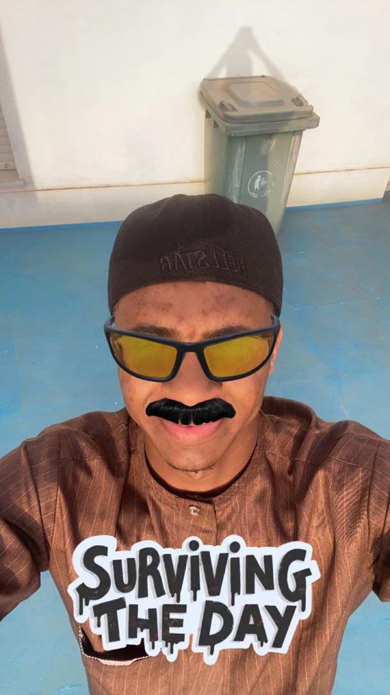

# About Me
<html lang="en">
<head>
  <meta charset="UTF-8">
  <meta name="viewport" content="width=device-width, initial-scale=1.0">
  <title>User Profile Card</title>
  
</head>
<body>
  

    

      
    

    <h1>Abbas Abdulrahman kawu (Bigdaddy)</h1>
    <h2>Student</h2>
    
Bonjour

    

        I’m an enthusiastic developer with a deep passion for coding and a strong desire to expand my knowledge. I enjoy exploring new technologies and honing my skills, always on the lookout for exciting challenges. Whether I’m creating innovative applications or experimenting with the latest programming languages, I’m eager to discover the limitless opportunities within the tech landscape.

        I invite you to join me on this adventure as I share my projects, insights, and the valuable lessons I encounter along the way. Let’s connect and grow together in this dynamic field!
        
        Feel free to modify it further to suit your style!
    

    

      
      
      
    

    

      <a href="+2348124304741" class="whatsapp-btn" alt="">Contact me on WhatsApp</a>
    

  

</body>
</html>
